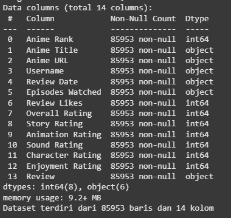

# Laporan Proyek Machine Learning - Aditiya Saputra ( Recomendation System)

## Project Overview
Proyek ini bertujuan untuk mengembangkan sebuah sistem rekomendasi anime yang mampu memberikan saran personal kepada pengguna berdasarkan preferensi dan interaksi mereka terhadap berbagai judul anime. Dengan memanfaatkan data pengguna dan rating terhadap anime, sistem ini dibangun menggunakan teknik Collaborative Filtering berbasis model neural network, khususnya pendekatan Neural Collaborative Filtering (NCF).

Sistem rekomendasi ini dirancang untuk meningkatkan pengalaman pengguna dengan mempermudah penemuan anime baru yang sesuai dengan minat mereka. Hal ini penting karena banyak pengguna kesulitan menemukan anime yang relevan dari ribuan pilihan yang tersedia. Dengan memberikan rekomendasi yang akurat dan personal, sistem ini diharapkan mampu meningkatkan engagement pengguna di platform streaming anime.

Model yang dibangun memanfaatkan informasi rating yang diberikan oleh pengguna terhadap anime tertentu. Dengan pendekatan ini, sistem dapat mempelajari pola preferensi dan memberikan prediksi terhadap anime lain yang mungkin disukai pengguna tersebut. Pendekatan ini juga dapat dikembangkan untuk platform lain seperti film, musik, atau e-commerce.
  
Referensi: [[Analyzing the effectiveness of collaborative filtering and content-based filtering methods in anime recommendation systemsi]](http://repository.uin-malang.ac.id/17878/) 

## Business Understanding
Dalam era digital saat ini, meningkatnya minat terhadap anime dan pertumbuhan pesat platform streaming menciptakan tantangan dalam membantu pengguna menemukan konten yang sesuai dengan preferensi mereka. Banyaknya pilihan membuat pengguna kewalahan dan berpotensi meninggalkan platform jika tidak menemukan tontonan yang menarik. Untuk menjawab tantangan tersebut, proyek ini bertujuan membangun sistem rekomendasi anime berbasis collaborative filtering guna meningkatkan pengalaman pengguna, memperpanjang waktu konsumsi konten, serta mendorong loyalitas pengguna terhadap platform. Dengan memahami pola penilaian dan kesamaan selera antar pengguna, sistem ini diharapkan mampu memberikan rekomendasi anime yang lebih personal, relevan, dan memuaskan.
### Problem Statements
* Bagaimana memberikan rekomendasi anime yang sesuai dengan preferensi pengguna berdasarkan histori penilaian anime?
* Apakah metode collaborative filtering mampu mengidentifikasi kesamaan antar pengguna dan memberikan saran anime yang relevan?
* Bagaimana akurasi sistem rekomendasi yang dibangun dalam menyarankan anime yang disukai pengguna?
### Goals
* Membangun sistem rekomendasi anime berbasis collaborative filtering.
* Menggunakan data rating pengguna terhadap anime untuk menemukan pola kesukaan yang serupa antar pengguna.
* Mengevaluasi performa sistem rekomendasi dengan metrik akurasi rekomendasi seperti RMSE, MSE dan MAE.

 ### Solution statements
* Data Preparation: Mengambil dataset anime review dari Kaggle, melakukan pembersihan data (menghapus rating kosong atau tidak valid), normalisasi rating, dan encoding kolom categorical (Username dan Anime Title) menjadi ID numerik untuk memudahkan pemodelan.
* Model Building: Membangun model Neural Collaborative Filtering menggunakan embedding layers untuk pengguna dan anime, menghitung kecocokan menggunakan dot product, dan memproses hasil dengan fungsi aktivasi sigmoid. Regularisasi L2 digunakan untuk menghindari overfitting.
* Model Training & Evaluation: Melatih model menggunakan MSE sebagai fungsi kerugian dengan EarlyStopping untuk mencegah overfitting, dan mengevaluasi model menggunakan metrik MAE, MSE, dan RMSE untuk memastikan akurasi prediksi rating.
* Recommender System: Menggunakan model untuk memprediksi rating yang belum diberikan oleh pengguna terhadap anime, dan memberikan rekomendasi 10 anime dengan rating tertinggi berdasarkan preferensi pengguna.

## Data Understanding
Sumber Data: Dataset yang digunakan diperoleh dari platform Kaggle, dengan dataset berjudul ["Top 10K Anime Details"](https://www.kaggle.com/datasets/stoicstatic/mal-top-10k-anime-details), yang berisi data tentang anime beserta ulasan yang diberikan oleh pengguna. Dataset ini mencakup 85,953 baris data yang berisi informasi tentang anime, termasuk rating yang diberikan oleh pengguna pada berbagai aspek anime.

Struktur Dataset: Dataset ini memiliki 14 kolom dengan berbagai informasi mengenai anime dan ulasan pengguna. Berikut adalah penjelasan mengenai setiap kolom:

  

| **Kolom**             | **Tipe Data** | **Deskripsi**                                                           |
|-----------------------|---------------|-------------------------------------------------------------------------|
| `Anime Rank`          | int64         | Peringkat anime berdasarkan popularitas di platform                      |
| `Anime Title`         | object        | Judul anime                                                            |
| `Anime URL`           | object        | URL untuk informasi lebih lanjut tentang anime                          |
| `Username`            | object        | Nama pengguna yang memberikan rating                                    |
| `Review Date`         | object        | Tanggal ulasan diberikan oleh pengguna                                  |
| `Episodes Watched`    | object        | Jumlah episode yang sudah ditonton oleh pengguna                        |
| `Review Likes`        | int64         | Jumlah suka yang diterima pada ulasan                                  |
| `Overall Rating`      | int64         | Rating keseluruhan yang diberikan oleh pengguna                         |
| `Story Rating`        | int64         | Rating khusus untuk cerita anime                                        |
| `Animation Rating`    | int64         | Rating khusus untuk animasi anime                                       |
| `Sound Rating`        | int64         | Rating khusus untuk kualitas suara anime                                |
| `Character Rating`    | int64         | Rating khusus untuk karakter anime                                      |
| `Enjoyment Rating`    | int64         | Rating berdasarkan tingkat kesenangan yang dirasakan pengguna saat menonton anime |
| `Review`              | object        | Teks ulasan yang diberikan oleh pengguna                                |

### Exploratory Data Analysis
#### Top 10 Anime yang di Nilai Atau Di Review
      Tujuan dari analisis ini adalah untuk mengetahui anime yang mendapat perhatian atau popularitas tertinggi berdasarkan seberapa sering anime tersebut dinilai atau direview. Hal ini membantu untuk mengidentifikasi anime yang sedang tren atau menarik bagi banyak orang, serta memberikan wawasan mengenai preferensi atau minat pengguna dalam kategori anime tertentu. Pada visualisasi dibawah sekitar 10 anime teratas mendapat penilaian sebanyak 80 review atau penilaian
      
  

  

#### Distribusi Overall Rating
    Untuk memvisualisasikan sebaran atau distribusi rating keseluruhan yang diberikan oleh pengguna pada anime dalam dataset. Dengan mengetahui distribusi rating, kita bisa memahami bagaimana pengguna memberikan penilaian terhadap anime secara umum, apakah kebanyakan rating cenderung tinggi, rendah, atau tersebar merata di berbagai kategori rating. Ini membantu untuk mengidentifikasi tren umum dalam penilaian pengguna terhadap anime dan juga dapat menunjukkan bias atau ketidakseimbangan dalam pemberian rating.Berdasarkan diagram dibawah, nilai rating yang paling umum diberikan oleh user yaitu 8, dan yang paling rendah 1

  

  

## Data Preparation
Pada bagian ini Anda menerapkan dan menyebutkan teknik data preparation yang dilakukan. Teknik yang digunakan pada notebook dan laporan harus berurutan.

**Rubrik/Kriteria Tambahan (Opsional)**: 
- Menjelaskan proses data preparation yang dilakukan
- Menjelaskan alasan mengapa diperlukan tahapan data preparation tersebut.

## Modeling
Tahapan ini membahas mengenai model sisten rekomendasi yang Anda buat untuk menyelesaikan permasalahan. Sajikan top-N recommendation sebagai output.

**Rubrik/Kriteria Tambahan (Opsional)**: 
- Menyajikan dua solusi rekomendasi dengan algoritma yang berbeda.
- Menjelaskan kelebihan dan kekurangan dari solusi/pendekatan yang dipilih.

## Evaluation
Pada bagian ini Anda perlu menyebutkan metrik evaluasi yang digunakan. Kemudian, jelaskan hasil proyek berdasarkan metrik evaluasi tersebut.

Ingatlah, metrik evaluasi yang digunakan harus sesuai dengan konteks data, problem statement, dan solusi yang diinginkan.

**Rubrik/Kriteria Tambahan (Opsional)**: 
- Menjelaskan formula metrik dan bagaimana metrik tersebut bekerja.

**---Ini adalah bagian akhir laporan---**

_Catatan:_
- _Anda dapat menambahkan gambar, kode, atau tabel ke dalam laporan jika diperlukan. Temukan caranya pada contoh dokumen markdown di situs editor [Dillinger](https://dillinger.io/), [Github Guides: Mastering markdown](https://guides.github.com/features/mastering-markdown/), atau sumber lain di internet. Semangat!_
- Jika terdapat penjelasan yang harus menyertakan code snippet, tuliskan dengan sewajarnya. Tidak perlu menuliskan keseluruhan kode project, cukup bagian yang ingin dijelaskan saja.
